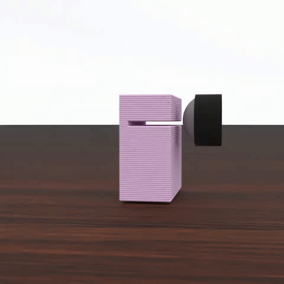
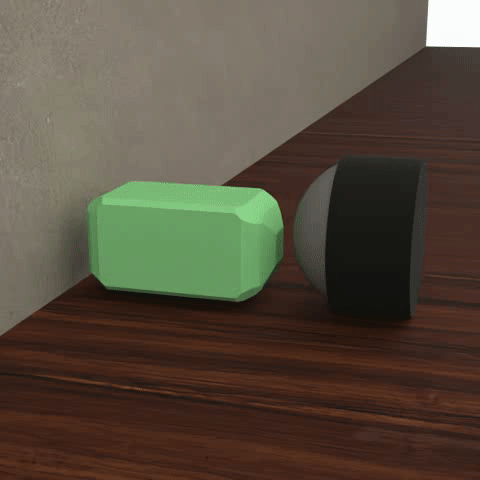
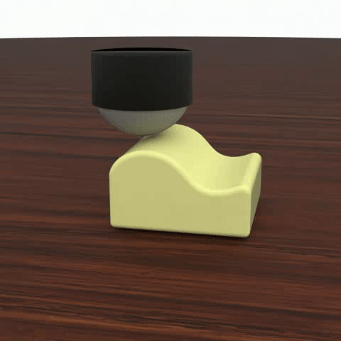

# DiffTactile: A Physics-based Differentiable Tactile Simulator for Contact-rich Robotic Manipulation

<p align="center">
  
  
  
  
</p>

This package provides a tactile simulator with differential physics for contact-rich manipulation tasks . It models soft tactile sensors, objects with various material properties, and contact between sensors and objects.
For more information, please refer to the [project webpage](https://difftactile.github.io/) or [corresponding paper](https://openreview.net/forum?id=eJHnSg783t).

## Installation
You can create a Conda environment for this simulator:
```bash
conda create -n difftactile python=3.9.16
conda activate difftactile
```

And install the package with its dependencies using
```bash
git clone https://github.com/DiffTactile/DiffTactile.git
cd DiffTactile
pip install -r requirements.txt -e .
```

## File Structure
- `meshes` includes all object and sensor mesh models.
- `object_model` includes soft (elastic, elastoplastic), rigid, multi-material, and cable object models.
- `sensor_model` includes FEM tactile sensor model and parallel-jaw gripper model.
- `tasks` includes gradient-based skill learning for manipulation tasks.
-  `baseline` includes baseline methods (CMA-ES, PPO, SAC, RNN) implementation.

## Usage example
Under the tasks, run
```bash
python box_open.py --use_state --use_tactile
```
- `use_state` means using state rewards
- `use_tactile` means using tactile rewards

This will optimize the trajectory of the box opening task with differential physics.

## License
This project is licensed under MIT license, as found in the [LICENSE](LICENSE) file.

## Citating DiffTactile
If you use DiffTactile in your research, please cite
```BibTeX
@inproceedings{
si2024difftactile,
title={{DIFFTACTILE}: A Physics-based Differentiable Tactile Simulator for Contact-rich Robotic Manipulation},
author={Zilin Si and Gu Zhang and Qingwei Ben and Branden Romero and Zhou Xian and Chao Liu and Chuang Gan},
booktitle={The Twelfth International Conference on Learning Representations},
year={2024},
url={https://openreview.net/forum?id=eJHnSg783t}
}
```
